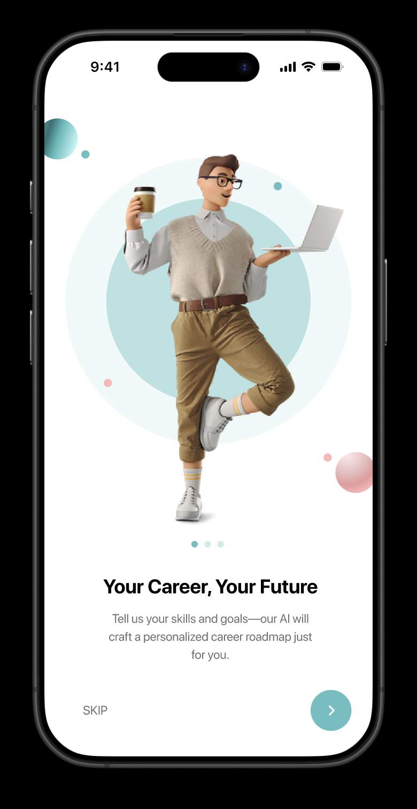
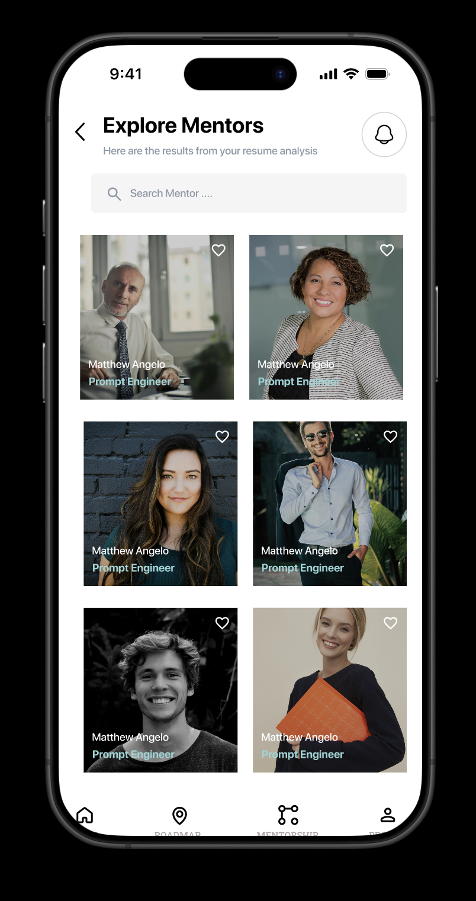
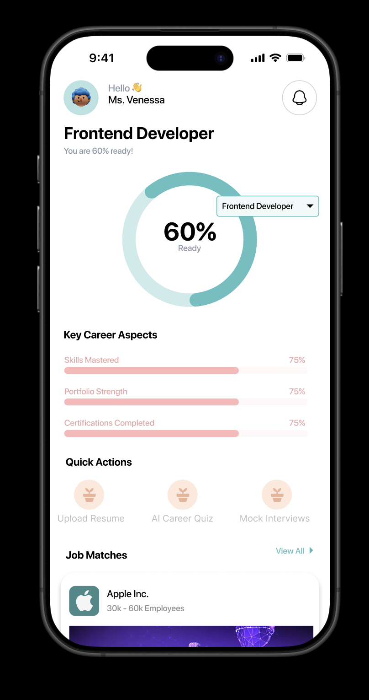

# **Resumate**

Imagine this: you're a student, a job seeker, or someone stuck in a career you don’t love. You know there's more out there, you know you need to upskill, but where do you even start?

You search online. Thousands of courses, free certifications, and career guides pop up. But instead of feeling hopeful, you feel overwhelmed. Which course is legit? Which one actually helps? Should you learn coding, digital marketing, or UX design? And even if you choose one, who tells you what’s next?

People give up, not because they lack ambition, but because they lack direction. They end up settling for jobs that don’t fulfill them, scrolling past opportunities they don’t even know exist.

## **Problem Statement**

Many job seekers struggle to find the right career path, optimize their resumes, and prepare for interviews. While free resources exist, they’re scattered and hard to navigate. Without personalized guidance, people waste time on trial and error.

## **Project Goal**

The goal of **Resumate** is to design an intuitive and engaging **AI-powered career mentoring platform** that helps users navigate their career journey with ease. Resumate will provide personalized career roadmaps, AI-driven resume reviews, and mock interview coaching, ensuring job seekers can confidently pursue their ideal roles.

## **Features**

- **Personalized Career Roadmaps**: Get customized guidance based on your career goals.
- **AI-Powered Resume Reviews**: Optimize your resume with AI-driven suggestions for improvement.
- **Mock Interview Coaching**: Practice mock interviews and get feedback on your performance.
- **Job Opportunities**: Discover job matches tailored to your skills and preferences.
- **Career Guidance**: Receive ongoing support from AI mentors to help you navigate the job search process.

## **Tech Stack**

- **Frontend**: Built with **Flutter**, following the **MVVM** architecture, using **GetX** for state management.
- **Backend**: Powered by **ActionHero.js**, **TypeScript**, and **MongoDB**.
- **AI Integration**: Leverages AI to provide intelligent career advice, resume reviews, and interview coaching.

## **Architecture Overview**

- The frontend of Resumate is built using **Flutter**, adhering to the **MVVM (Model-View-ViewModel)** architecture. This ensures a clear separation of concerns, making the codebase easier to maintain and scale.
- **GetX** is used as the state management solution, ensuring a responsive and efficient UI.
- The backend is designed with **ActionHero.js** and **TypeScript**, allowing for scalable and real-time interaction with users.
- **MongoDB** is used as the database, providing flexibility and scalability for user data and career resources.

## **Installation Guide**

### **Frontend (Flutter)**

1. Clone the repository:

    ```bash
    git clone https://github.com/yourusername/resumate_flutter.git
    cd resumate_flutter
    ```

2. Install dependencies:

    ```bash
    flutter pub get
    ```

3. Run the app:

    ```bash
    flutter run
    ```

### **Backend (ActionHero.js)**

1. Clone the backend repository:

    ```bash
    git clone https://github.com/yourusername/resumate_backend.git
    cd resumate_backend
    ```

2. Install dependencies:

    ```bash
    npm install
    ```

3. Run the backend server:

    ```bash
    npm start
    ```

## **Screenshots**

Here are some screenshots of the app in action:

<p align="center">
  
  
  
</p>


## **Links**

- **APK Download**: [Download the APK](https://drive.google.com/drive/folders/1Ath_rNVLWPxO6YylJf1BtSAEzQjJ2iaB?usp=drive_link)
- **Figma Design**: [View the Figma design](https://www.figma.com/design/MoGYjG2sGtVZHkIYeHtuLx/ResuMate?node-id=44-2304&t=VC1dFgCELWCbtVb2-1)
- **Web Application**: [Access the web version](https://heroic-pavlova-0dcaef.netlify.app/)
- **Backend API**: [View the backend API documentation](https://resumate-backend-6dis.onrender.com)


## **Contributing**

We welcome contributions to **Resumate**! Please fork the repository, make your changes, and create a pull request. We will review your changes and get back to you.

## **License**

This project is licensed under the MIT License - see the [LICENSE](LICENSE) file for details.
